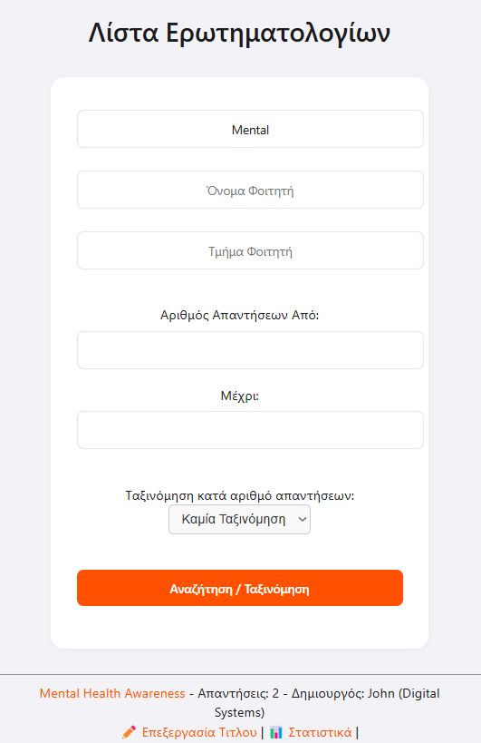
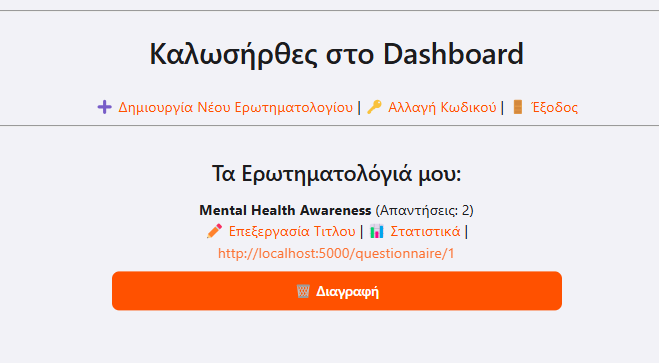
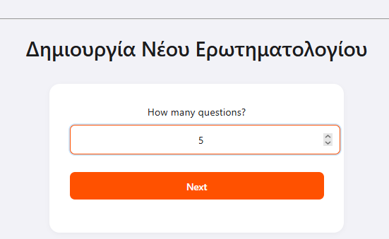
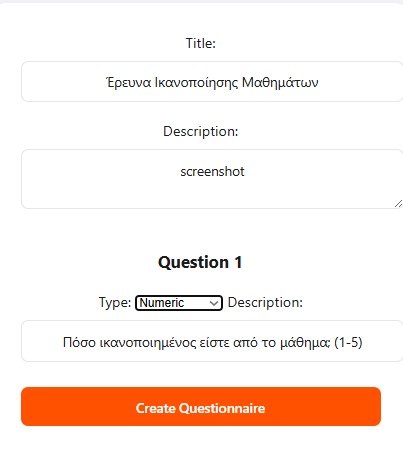
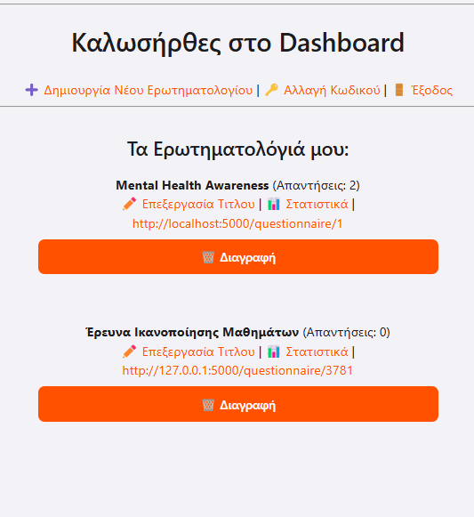
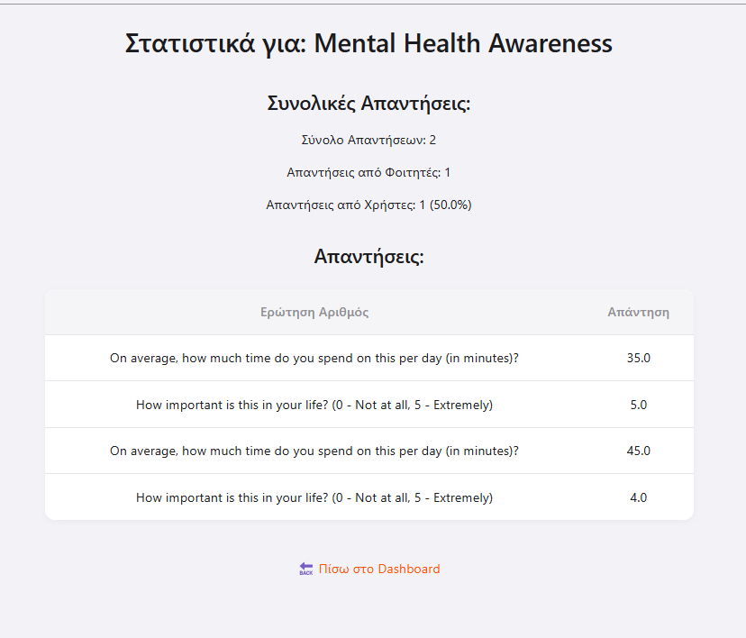
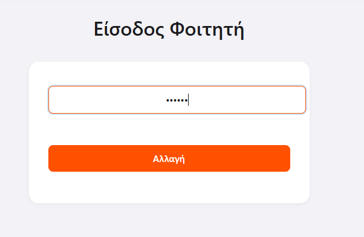
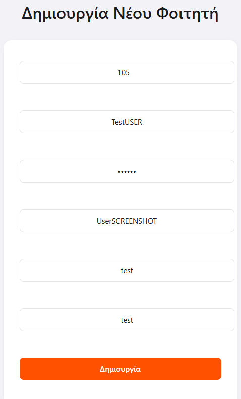
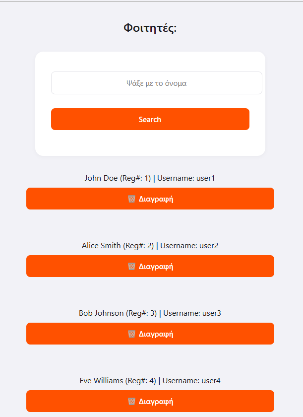
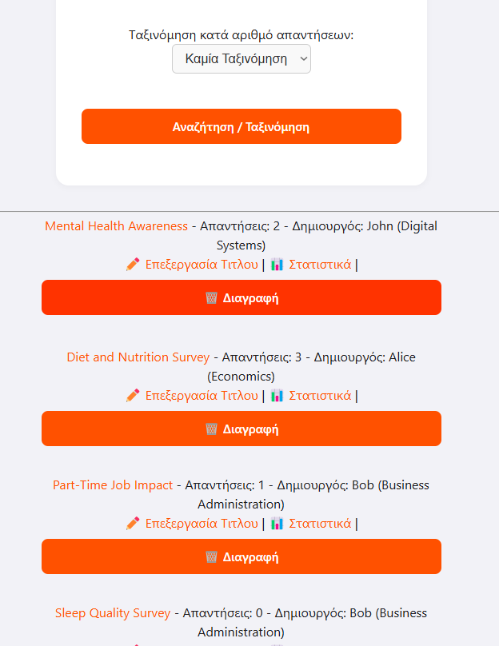

# Σύστημα Δημιουργίας, Εύρεσης και Συμπλήρωσης Ερωτηματολογίων

## Περιεχόμενα
- [Τεχνολογίες που Χρησιμοποιήθηκαν](#τεχνολογίες-που-χρησιμοποιήθηκαν)
- [Περιγραφή Αρχείων](#περιγραφή-αρχείων)
- [Περιγραφή Βάσης Δεδομένων](#περιγραφή-βάσης-δεδομένων)
- [Τρόπος Εκτέλεσης Συστήματος](#τρόπος-εκτέλεσης-συστήματος)
- [Τρόπος Χρήσης Συστήματος](#τρόπος-χρήσης-συστήματος)
- [Αναφορές](#αναφορές)

---

## Τεχνολογίες που Χρησιμοποιήθηκαν

- **Python 3.11**
- **Flask** – για τη δημιουργία του API Server και των templates
- **MongoDB** – για την αποθήκευση των δεδομένων
- **Docker / Docker Compose** – για εκτέλεση του API Server και της Βάσης
- **HTML,CSS(μέσω Flask Templates)** – για το UI

---

## Περιγραφή Αρχείων

| Όνομα Αρχείου              | Περιγραφή |
|----------------------------|-----------|
| `init.py`                  | Κύριο Flask αρχείο – περιέχει όλα τα routes |
| `db.py`                    | Για σύνδεση με το MongoDB
| `routes/`                  | Routes και λογική για Student,Questionnaire,Admin |
| `utils/utils.py`           | Function που χρησιμοποιούνται σε πάνω απο ένα route |
| `preload.py`               | Insert data στο docker build |
| `templates/`               | HTML αρχεία για UI |
| `static/`                  | CSS |
| `docker-compose.yml`       | Ορίζει τα containers για Flask και MongoDB |
| `Dockerfile`               | Docker image για Flask app |
| `README.md`                | Το παρόν αρχείο τεκμηρίωσης |

---

## Περιγραφή Βάσης Δεδομένων

Η εφαρμογή χρησιμοποιεί MongoDB με τις εξής collections:

### 1. `Students`
```json
{
 "_id": "67fd4756924b9b9e72a35289",
  "username": "user1",
  "password": "pass1",
  "reg_number": 1,
  "name": "John",
  "surname": "Doe",
  "department": "Digital Systems"
}
```

### 2. `Questionnaires`
```json
{
  "_id": "67fd477f924b9b9e72a352f3",
  "student_id": 1,
  "questionnaire_id": 1,
  "title": "Mental Health Awareness",
  "description": "Surveying stress levels and mental health practices.",
  "questions": [
    "How often do you feel stressed?",
    "Do you practice any relaxation techniques?"
  ],
  "answer_count": 7,
  "unique_url": "localhost:5000/questionnaire/1"
}
```

### 3. `answered_questionnaires`
```json
{
  "_id": "67fd4791924b9b9e72a35359",
  "questionnaire_id": 1,
  "from_student": false,
  "answers": [
    {
      "question_num": 1,
      "content": "35"
    },
    {
      "question_num": 2,
      "content": "5"
    }
  ]
}
```

---

## Τρόπος Εκτέλεσης Συστήματος

1. **Προαπαιτούμενα**:  
   - Docker  
   - Docker Compose

2. **Οδηγίες Εκτέλεσης**:
```bash
git clone https://github.com/username/questionnaire-app
cd questionnaire-app
docker-compose up --build
```

3. **Η εφαρμογή θα είναι διαθέσιμη στο**:
   ```
   http://localhost:5000
   ```

4. **Η MongoDB αποθηκεύει τα δεδομένα στον φάκελο `./data` του host**.

---

## Τρόπος Χρήσης Συστήματος

### 1. Απλός Χρήστης (User)
-Προβολή/Ταξινόμηση/Αναζήτηση Ερωτηματολογίων
-Συνδυαστική Αναζήτηση και Ταξινόμηση
-Άνοιγμα Ερωτηματολογίου μέσω URL
-Συμπλήρωση Ερωτηματολογίου

- **Παράδειγμα:**  
  - Επισκεπτόμαστε `http://localhost:5000/questionnaires`  
  - Στη γραμμή αναζήτησης πληκτρολογούμε "Ικανοποίηση" για να βρούμε σχετικά ερωτηματολόγια.
  

- **Συμπλήρωση Ερωτηματολογίου:**  
  - Πατώντας σε ένα ερωτηματολόγιο, ανοίγει η φόρμα με τις ερωτήσεις.  
  - Ο χρήστης συμπληρώνει και υποβάλλει τις απαντήσεις.  


### 2. Φοιτητής (Student)
-Όλες οι λειτουργίες του User
-Είσοδος / Έξοδος από το σύστημα
-Αλλαγή κωδικού
-Δημιουργία ερωτηματολογίου
-Προβολή/Επεξεργασία/Διαγραφή ερωτηματολογίων που έχει δημιουργήσει
-Στατιστικά απαντήσεων (πλήθος και ποσοστά)



- **Παράδειγμα:**  
  - Δημιουργούμε ένα ερωτηματολόγιο με 1 ερωτήσεις:  
  
  - Δημιουργούμε ένα ερωτηματολόγιο με τίτλο:  
    `"Έρευνα Ικανοποίησης Μαθημάτων"`  
  - Προσθέτουμε ερώτηση:  
    `"Πόσο ικανοποιημένος είστε από το μάθημα; (1-5)"`
    

- **Επεξεργασία/Διαγραφή Ερωτηματολογίου:**  
  - Στην ενότητα **"Τα Ερωτηματολόγιά μου"**, βλέπουμε όλα τα ερωτηματολόγια που έχουμε δημιουργήσει.  
  - Μπορούμε να επεξεργαστούμε ή να διαγράψουμε κάποιο από αυτά.
  

- **Στατιστικά Απαντήσεων:**  
  - Επιλέγοντας ένα ερωτηματολόγιο, μπορούμε να δούμε τα συγκεντρωτικά στατιστικά (πλήθος απαντήσεων, ποσοστά ανά επιλογή).
  

- **Αλλαγή Κωδικού:**  
  - Στο dashboard, μπορούμε να αλλάξουμε τον κωδικό πρόσβασης.
  


### 3. Διαχειριστής (Admin)
-Όλες οι λειτουργίες του Student
-Διαγραφή οποιουδήποτε ερωτηματολογίου
-Δημιουργία και Διαγραφή φοιτητών


- **Σύνδεση:**  
  - Χρησιμοποιούμε τα admin credentials (username:admin password:admin123).

- **Διαχείριση Φοιτητών:**  
  - Δημιουργούμε νέους φοιτητές, ορίζοντας username και password.  
  
  - Μπορούμε να διαγράψουμε ή να τροποποιήσουμε υπάρχοντες λογαριασμούς φοιτητών.
  

- **Διαγραφή Ερωτηματολογίων:**  
  - Ο admin έχει δικαίωμα να διαγράψει οποιοδήποτε ερωτηματολόγιο στο σύστημα.



## Αναφορές

- Flask Documentation: https://flask.palletsprojects.com/
- MongoDB Python Driver: https://pymongo.readthedocs.io/
- Docker Compose: https://docs.docker.com/compose/
- Jinja2 Templates: https://jinja.palletsprojects.com/
